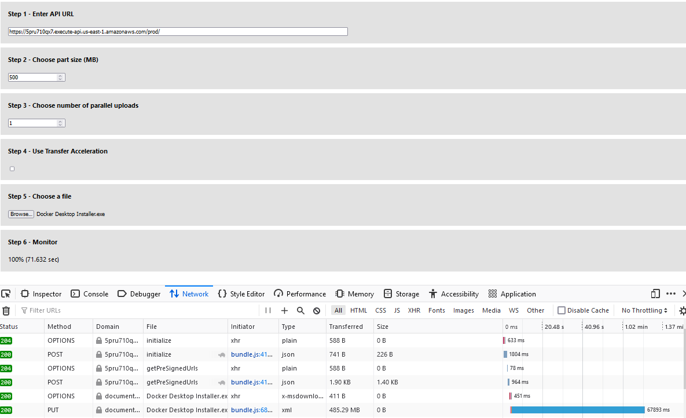
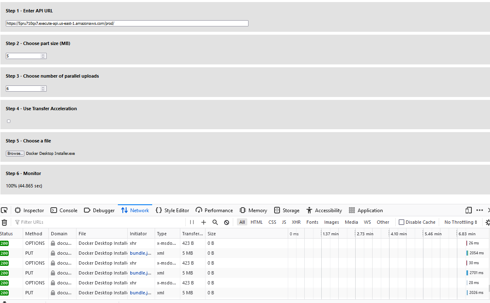
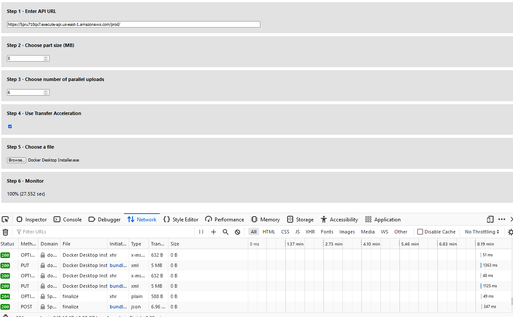
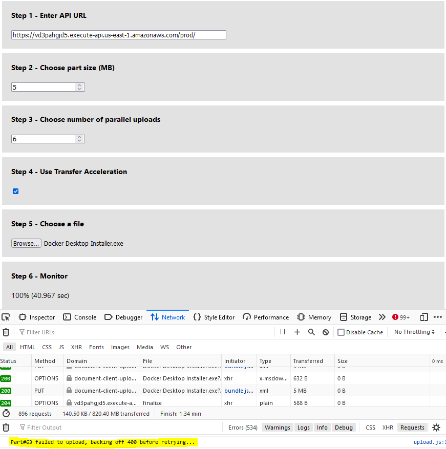
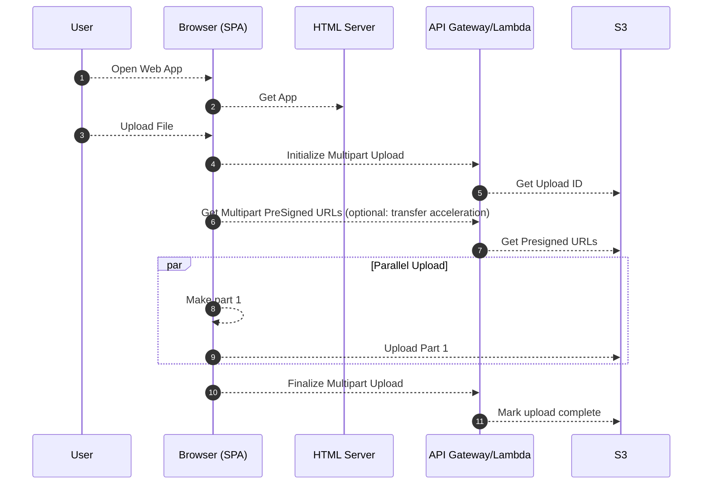

# Uploading large objects to Amazon S3 using multipart upload feature and transfer acceleration
[Amazon Photos](https://www.amazon.com/Amazon-Photos/b?ie=UTF8&node=13234696011) is a secure online storage for photos and videos. Users can upload their photos and videos to Amazon photos using a web browser. Uploading files to a web server is a common feature found in many web applications accessible through a web browser. A web application communicates with a web server using HyperText Transfer Protocol ("HTTP"). A single HTTP connection used to upload a file cannot use the full bandwidth available to the web application due to the underlying [TCP throughput limits](https://en.wikipedia.org/wiki/TCP_tuning#TCP_speed_limits). To overcome this limit, a large file is split into multiple parts and uploaded concurrently using multiple HTTP connections. A web application uploading a large file to [Amazon S3](https://docs.aws.amazon.com/AmazonS3/latest/userguide/Welcome.html) service can take advantage of the S3 multipart upload feature to improve throughput and upload speed. See this [link](https://docs.aws.amazon.com/AmazonS3/latest/userguide/mpuoverview.html) for all the benefits with using S3 multipart upload feature. Amazon S3 Transfer Acceleration is a bucket-level feature that enables fast, easy, and secure transfers of files over long distances between your client and an S3 bucket. See this [link](https://docs.aws.amazon.com/AmazonS3/latest/userguide/transfer-acceleration.html) for details on S3 Transfer Acceleration.

This prototype project is intended to show a way to implement multipart upload and transfer acceleration directly from the browser using presigned URLs. 

## Deploy the application
### Prerequisite
- Install and configure [AWS CLI](https://aws.amazon.com/cli/)
- Install and bootstrap [AWS CDK](https://aws.amazon.com/cdk/)

### Backend
- Clone this repository to your local computer. 
- From the backendv2 folder, run "npm install" to install all dependencies. Use "npm audit" to check for known vulnerabilites on the dependent packages.
- Use CDK to deploy the backend to AWS. For example,
```
cdk deploy --context env="randnumber" --context whitelistip="xx.xx.xxx.xxx"
```
An additional context variable called "urlExpiry" can be used to set specific expiration time on the S3 presigned URL. The default value is set at 300 seconds (5 min). A new S3 bucket with the name "document-upload-bucket-randnumber" is created for storing the uploaded files, and the whitelistip value is used to allow API Gateway access from this IP address only. 
- Make note of the API Gateway endpoint URL.

### Frontend 
- From the frontend folder, run "npm install" to install the packages.
- Optionally, you can run "npm audit --production" to check on vulnerabilities.
- Run "npm run start" to launch the frontend application from the browser. 
- Use the user interface shown in the browser.
- For Step 1, enter the API Gateway endpoint URL.
- For Step 2 and Step 3, pick a baseline number. Use your available bandwidth, TCP window size, and retry time requirements to determine the optimal part size. This needs to be a minimum of 5 MB though. Web browsers have a limit on the number of concurrent connections to the same server. In Firefox, the default is 6 connections. Specifying a larger number of concurrent connections will result in blocking on the web browser side.
- For Step 4, pick whether to use transfer acceleration feature or not.
- For Step 5, pick a large file to upload.
- The final part of the user interface will show upload progress and the time to upload the file to S3. 

## Improved throughput – You can upload parts in parallel to improve throughput
In this section, a sample file "Docker Desktop Installer.exe" (485MB) will be used for testing improved throughput. The web application and the S3 bucket are in the US East region. The internet speed test on the web browser client showed the client can upload at 79 Megabits per second. The results of uploading the sample file as a single part, single part with transfer acceleration, multiple parts, and multiple parts with transfer acceleration is shown below for reference.

### Test 1: Single part upload (72 seconds)

### Test 2: Single part upload with transfer acceleration (43 seconds)

### Test 3: Multiple parts upload (45 seconds)

### Test 4: Multiple parts upload with transfer acceleration (28 seconds)



## Quick recovery from any network issues – Smaller part size minimizes the impact of restarting a failed upload due to a network error
### Test 5: Recover from a simulated network issue
A network issue is simulated by activating Firefox "Work Offline" mode while a multiple parts upload with transfer acceleration is in progress. As show below, the client side web application will wait for a certain period of time before retrying the upload process. When the browser goes online by de-activating "Working Offline", the parts that failed to upload will be uploaded automatically. This feature minimized the impact of restarting a failed upload due a transient network issue. 



## Recommendation
As seen from the results, uploading a large file using the S3 multipart upload feature and transfer acceleration can speed up the upload process time by 61% ((72-28/72)*100). This is made possible by improving throughput with multipart upload and reducing latency with transfer acceleration. By uploading smaller parts on the client side and utilizing exponential backoff retry strategy for failed uploads, a quicker automatic recovery from network issues is made possible.


## Cleanup
- Use "cdk destroy" to delete the stack of cloud resources created in this solution deployment.


## Security 
- SonarLint is used in VSCode to confirm there are no problems in the codebase.
- npm audit is used to confirm there are no security vulnerabilities with the project dependencies. For the frontend package audit, use the command "npm audit --production".
- S3 bucket created in this project is setup to enforce ssl requests only and encrypt data at rest.
- S3 bucket is setup to block public access.
- API Gateway is setup with a resource policy to allow requests from the specified IP address used during deployment. Presigned S3 URLs are setup to expire in 5 minutes by default.

## Architecture


## Credit
This project is inspired by a [blog post from LogRocket](https://blog.logrocket.com/multipart-uploads-s3-node-js-react/) but utilizes AWS serverless services to implement the backend. The frontend is rebuilt from scratch with enhancements for using transfer acceleration and usability. 

